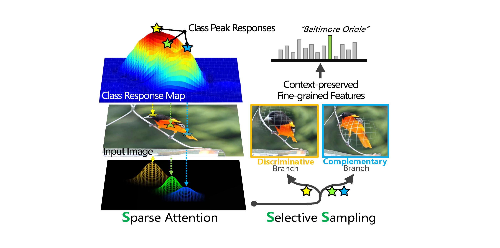

<h2 align="center">Selective Sparse Sampling for Fine-grained Image Recognition</h2>



## PyTorch Implementation
The [pytorch branch](#) contains:

* the **pytorch** implementation of Selective Sparse Sampling.
* the CUB-200-2011 demo (training, test).

Please follow the instruction below to install it and run the experiment demo.

### Prerequisites
* System (tested on Ubuntu 14.04LTS and Win10)
* 2 Tesla P100 + CUDA CuDNN (CPU mode is also supported but significantly slower)
* [Python>=3.6.8](https://www.python.org)
* [PyTorch>=0.4.1](https://pytorch.org)
* [Jupyter Notebook](https://jupyter.org/install.html)
* [Nest](https://github.com/ZhouYanzhao/Nest.git)

### Installation
    
1. Install S3N via Nest's CLI tool:

    ```bash
    # note that data will be saved under your current path
    $ git clone -b review https://github.com/TmpSav/SSS.git ./S3N
    $ nest module install ./S3N/ s3n
    # verify the installation
    $ nest module list --filter s3n
    ```

### Prepare Data

1. Download the CUB-200-2011 dataset:

    ```bash
    $ mkdir ./S3N/datasets
    $ cd ./S3N/datasets
    # download and extract data
    $ wget http://www.vision.caltech.edu/visipedia-data/CUB-200-2011/CUB_200_2011.tgz
    $ tar xvf CUB_200_2011.tgz
    ```

2. Prepare annotation files:
    
    Move the file ./datasets/train.txt and ./datasets/test.txt into ./datasets/CUB_200_2011. The list of image file names and label is contained in the file ./datasets/CUB_200_2011/train.txt and ./datasets/CUB_200_2011/test.txt, with each line corresponding to one image:
    
    ```
    <image_name> <class_id>  
    ```

### Run the demo

1. run the code as:

    ```bash
    $ cd ./S3N
    # run baseline
    $ PYTHONWARNINGS='ignore' CUDA_VISIBLE_DEVICES=0,1 nest task run ./demo/cub_baseline.yml
    # run S3N
    $ PYTHONWARNINGS='ignore' CUDA_VISIBLE_DEVICES=0,1 nest task run ./demo/cub_s3n.yml
    ```